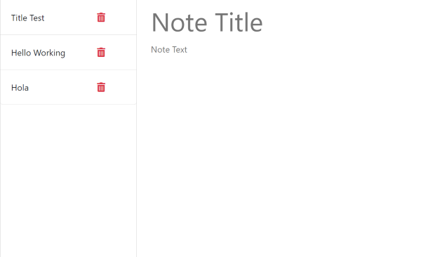

# Note Taker App

## Description

This is an application to write and save notes using Express.js, it is meant to be a tool to support people with busy schedules to keep track of their tasks to complete.

When the app is open in the localhost the user is met with a first page where a button to access the note taker appears, in the note taker home page the user will find all saves notes on the left followed by a trashcan icon to delete notes if needed. On the right theres a text box for a title and note to be typed. After typing a title the save button appears, if the user doesn't want to save the typed text cant press the + button next to save to clear the fields and start anew.

## Visuals
Welcome Window

Home Window

